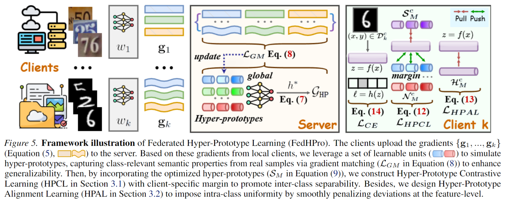

<div align="center">
  <h2>FedHPro - Federated Hyper-Prototype Learning (ICML 2026)</b></h2>
</div>

<div align="center">


[](https://opensource.org/licenses/Apache-2.0)

</div>

Official implementation of [FedHPro: Federated Hyper-Prototype Learning via Gradient Matching](https://github.com/mala-lab/FedHPro).

## Abstract

Federated Learning (FL) enables collaborative training of distributed clients while protecting privacy. To enhance generalization capability in FL, prototype-based FL is in the spotlight, since shared global prototypes offer semantic anchors for aligning client-specific local prototypes. However, existing methods update global prototypes at the prototype-level via averaging local prototypes or refining global anchors, which often leads to semantic drift across clients and subsequently yields a misaligned global signal. To alleviate this issue, we introduce **hyper-prototypes**, defined by a set of learnable global class-wise prototypes to preserve underlying semantic knowledge across clients. The hyper-prototypes are optimized via gradient matching to align with class-relevant characteristics distilled directly from clients' real samples, rather than prototype-level descriptors. We further propose **FedHPro**, a Federated Hyper-Prototype Learning framework, to leverage hyper-prototypes to promote inter-class separability via mutual-contrastive learning with client-specific margin, while encouraging intra-class uniformity through a consistency penalty. Comprehensive experiments under diverse heterogeneous scenarios confirm that 1) hyper-prototypes produce a more semantically consistent global signal, and 2) FedHPro achieves state-of-the-art performance on several datasets.



## Setup Libraries

- python >= 3.10.11
- torch >= 1.13.0
- torchvision >= 0.14.0
- scipy >= 1.10.1
- scikit-image >= 0.21.0
- numpy >= 1.24.3
- tqdm >= 4.64.0

## Federated Datasets

- **CIFAR-10/100** ([Download](https://www.cs.toronto.edu/~kriz/cifar.html)), **TinyImageNet** ([Download](https://www.kaggle.com/datasets/akash2sharma/tiny-imagenet)), **HAM10000** ([Download](https://www.kaggle.com/datasets/kmader/skin-cancer-mnist-ham10000)).
- **Digits**: include 4 domains (_MNIST, USPS, SVHN, SYN_). 【Download Link -> [[Google Drive]](https://drive.google.com/file/d/11kJ_xVB37J3_AXflccevnK-MJS8ETFcv/view?usp=sharing)】
- **Office-Caltech**: include 4 domains (_Caltech, Amazon, Webcam, DSLR_). 【Download Link -> [[Google Drive]](https://drive.google.com/file/d/1xm-_gh60c8iacCqTIHH0-q7ZUEexZLBo/view?usp=sharing)】

## Run Experiments

- Run FedHPro on **CIFAR10** with Non-IID $\mathtt{NID1}_{0.5}$ and Long-tailed $\rho=100$:
  ```python
  python3 main_run.py --dataset cifar10 --num_classes 10 --repeat_num 1 --batch_real 100 --non_iid_alpha 0.5 --imb_factor 0.01 --length_of_hp 5 --rounds_of_hp 30 --hp_info_t 0.05
  ```

## Citation

```
@inproceedings{wang2026fedhpro,
    author={Wang, Huan and Shen, Jun and Li, Haoran and Yang, Zhenyu and Yan, Jun and Manjang, Ousman and Zhai, Yanlong and Wu, Di and Pang, Guansong},
    title={FedHPro: Federated Hyper-Prototype Learning via Gradient Matching},
    booktitle={International Conference on Machine Learning},
    year={2026}
}
```
